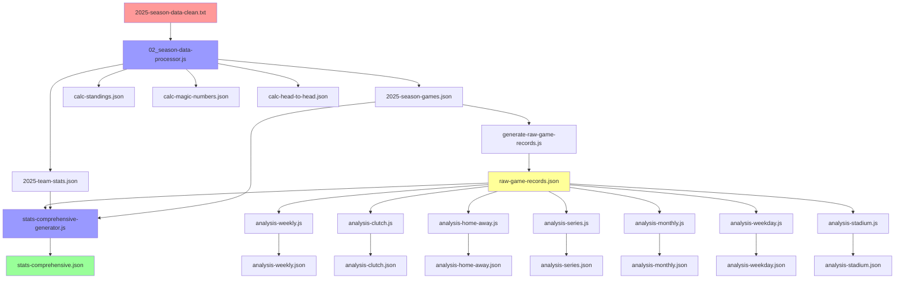

# JSON 파일 의존성 맵 📊

## 🔄 데이터 플로우 및 의존성 관계



## 📋 파일별 상세 정보

### 🔴 원본 데이터
| 파일명 | 역할 | 업데이트 방식 |
|--------|------|---------------|
| `2025-season-data-clean.txt` | 🌟 **최상위 원본 데이터** | 수동/크롤링 |

### 🔵 핵심 처리 스크립트
| 스크립트 | 입력 | 출력 | 역할 |
|----------|------|------|------|
| `02_season-data-processor.js` | 2025-season-data-clean.txt | 5개 핵심 JSON | **메인 데이터 처리** |
| `generate-raw-game-records.js` | 2025-season-games.json | raw-game-records.json | **게임 기록 변환** |
| `stats-comprehensive-generator.js` | 3개 소스 JSON | stats-comprehensive.json | **종합 통계** |

### 🟡 중간 데이터 (핵심)
| 파일명 | 생성자 | 의존 파일 | 역할 |
|--------|--------|-----------|------|
| `2025-season-games.json` | 02_season-data-processor | 원본 txt | 경기별 상세 데이터 |
| `2025-team-stats.json` | 02_season-data-processor | 원본 txt | 팀별 기본 통계 |
| `raw-game-records.json` | generate-raw-game-records | 2025-season-games.json | 팀별 게임 기록 |

### 🟢 최종 서비스 데이터
| 파일명 | 생성자 | 의존 파일들 | 사용 페이지 |
|--------|--------|-------------|-------------|
| ~~`api-data.json`~~ | ~~02_season-data-processor~~ | ~~원본 txt~~ | **통합됨 → stats-comprehensive.json** |
| `stats-comprehensive.json` | stats-comprehensive-generator | raw-game-records + 2025-team-stats + 2025-season-games | **루트 index.html** |
| `calc-standings.json` | 02_season-data-processor | 원본 txt | **매직넘버 페이지** |
| `calc-magic-numbers.json` | 02_season-data-processor | 원본 txt | **매직넘버 페이지** |
| `calc-head-to-head.json` | 02_season-data-processor | 원본 txt | **매직넘버 페이지** |

### 📊 분석 데이터
| 파일명 | 생성자 | 의존 파일 | 사용 페이지 |
|--------|--------|-----------|-------------|
| `analysis-weekly.json` | analysis-weekly.js | raw-game-records.json | **루트 index.html** |
| `analysis-clutch.json` | analysis-clutch.js | raw-game-records.json | **루트 index.html** |
| `analysis-home-away.json` | analysis-home-away.js | raw-game-records.json | **루트 index.html** |
| `analysis-series.json` | analysis-series.js | raw-game-records.json | **루트 index.html** |
| `analysis-monthly.json` | analysis-monthly.js | raw-game-records.json | - |
| `analysis-weekday.json` | analysis-weekday.js | raw-game-records.json | - |
| `analysis-stadium.json` | analysis-stadium.js | raw-game-records.json | - |

## ⚙️ GitHub Actions 업데이트 순서

```bash
# 1단계: 핵심 데이터 생성
npm run process  # 02_season-data-processor.js 실행
  ├── 2025-season-games.json ✅
  ├── 2025-team-stats.json ✅  
  ├── ~~api-data.json~~ (통합됨)
  ├── calc-standings.json ✅
  ├── calc-magic-numbers.json ✅
  └── calc-head-to-head.json ✅

# 2단계: 게임 기록 변환
npm run generate-raw-records  # generate-raw-game-records.js 실행
  └── raw-game-records.json ✅

# 3단계: 종합 통계 생성  
npm run enhanced-dashboard  # stats-comprehensive-generator.js 실행
  └── stats-comprehensive.json ✅

# 4단계: 모든 분석 실행
npm run analysis
  ├── analysis-weekly.json ✅
  ├── analysis-clutch.json ✅  
  ├── analysis-home-away.json ✅
  ├── analysis-series.json ✅
  ├── analysis-monthly.json ✅
  ├── analysis-weekday.json ✅
  └── analysis-stadium.json ✅
```

## 🚨 누락 위험 체크포인트

### ❌ 업데이트 누락이 발생할 수 있는 시나리오
1. **2단계 누락**: `generate-raw-records` 실행 안됨 → `raw-game-records.json` 오래된 데이터
2. **3단계 누락**: `enhanced-dashboard` 실행 안됨 → `stats-comprehensive.json` 최대연승/연패 0
3. **4단계 일부 누락**: 특정 분석 스크립트 실패 → 해당 `analysis-*.json` 업데이트 안됨

### ✅ 검증 방법
```bash
# 타임스탬프 확인
ls -la magic-number/data/*.json | grep "Sep  7"

# 핵심 파일 업데이트 시간 확인  
jq '.lastUpdated // .updateTime' magic-number/data/{api-data,stats-comprehensive,raw-game-records}.json
```

## 📱 페이지별 필수 JSON 의존성

### 🏠 루트 index.html
**필수 파일 (13개)**:
- ~~`api-data.json`~~ - **통합됨 → stats-comprehensive.json**
- `stats-comprehensive.json` - 종합 통계 + 연승/연패  
- `calc-head-to-head.json` - 상대전적 매트릭스
- `raw-game-records.json` - 연속기록 분석용
- `analysis-weekly.json` - 주차별 분석
- `analysis-clutch.json` - 클러치 상황  
- `analysis-home-away.json` - 홈/원정 분석
- `analysis-series.json` - 시리즈 분석
- `analysis-monthly.json` - 월별 분석
- `analysis-weekday.json` - 요일별 분석
- `analysis-stadium.json` - 경기장별 분석

### 🎯 매직넘버 페이지 (magic-number/index.html)
**필수 파일 (3개)**:
- `calc-standings.json` - 순위표
- `calc-magic-numbers.json` - 매직넘버 계산
- `calc-head-to-head.json` - 상대전적

## 🔍 업데이트 확인 스크립트 제안

```bash
#!/bin/bash
# json-health-check.sh

echo "🔍 JSON 파일 업데이트 상태 확인"
echo "=================================="

TARGET_DATE="2025-09-07"
MISSING_FILES=()

for file in magic-number/data/*.json; do
    if [[ $(stat -f "%Sm" -t "%Y-%m-%d" "$file") != "$TARGET_DATE" ]]; then
        MISSING_FILES+=("$(basename "$file")")
    fi
done

if [[ ${#MISSING_FILES[@]} -eq 0 ]]; then
    echo "✅ 모든 JSON 파일이 최신 상태입니다!"
else  
    echo "⚠️  다음 파일들이 오래된 것 같습니다:"
    printf '%s\n' "${MISSING_FILES[@]}"
fi
```

이 맵으로 어떤 JSON이 업데이트되지 않았는지 쉽게 추적할 수 있습니다!